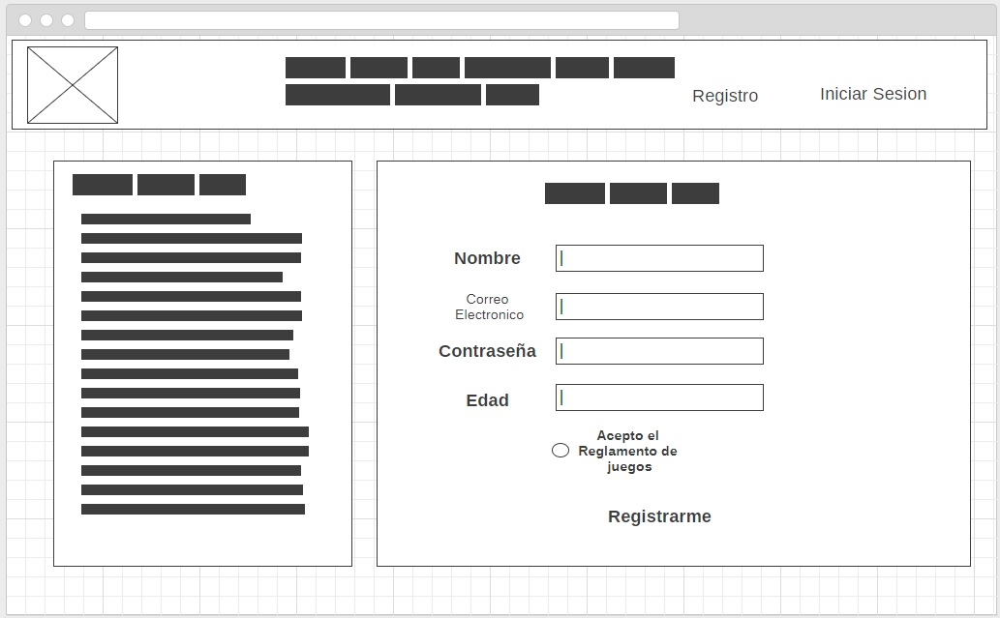
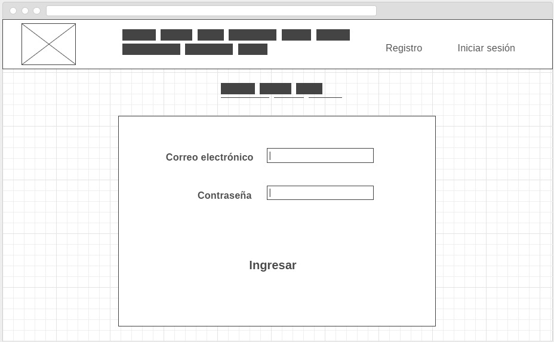

# **HISTORIAS DE USUARIO PROYECTO QUINIELA**

## **WALKING SKELETON**

### Reglas del juego:

#### 1. Reglamento del juego

Yo, como usuario del sitio de apuestas, deseo poder ingresar a un sitio que contenga

        * La lista de reglas ordenadas por números.
        * Checkbox para confirmar aceptación de reglamento
        * Botón "Acepto reglamento"

### Interfaz de registro:

#### 1. Formulario de registro

Yo, como usuario del sitio de apuestas, deseo poder registrarme en el sitio mediante un formulario que me solicite los siguientes datos:

        * Nombre completo
        * Correo electrónico
        * Contraseña
        * Edad
        * Botón "enviar"

#### 2. Log in

Yo, como usuario del sitio de apuestas, deseo que, para poder ingresar a mi perfil de usuario, el sitio verifique mi identidad con los siguientes datos:

        * Correo electrónico
        * Contraseña
        * Botón "Ingresar"

### Área de juego

#### 1. Tabla con listas de partidos y equipos

Yo, como usuario del sitio de apuestas, deseo que el sitio que contenga:

        * Una tabla con datos de equipos participantes 
        * Fechas y horarios de los juegos.

#### 2. Conformación de apuesta

Yo, como usuario del sitio de apuestas, deseo que, para poder realizar mi apuesta, el sitio cuente con: 

        * Checkboxes para cada partido "Gana", "Pierde", "Empata"

